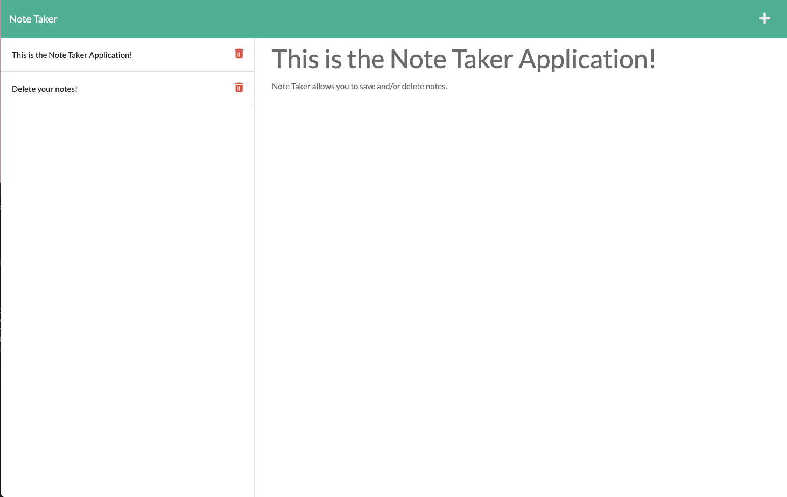
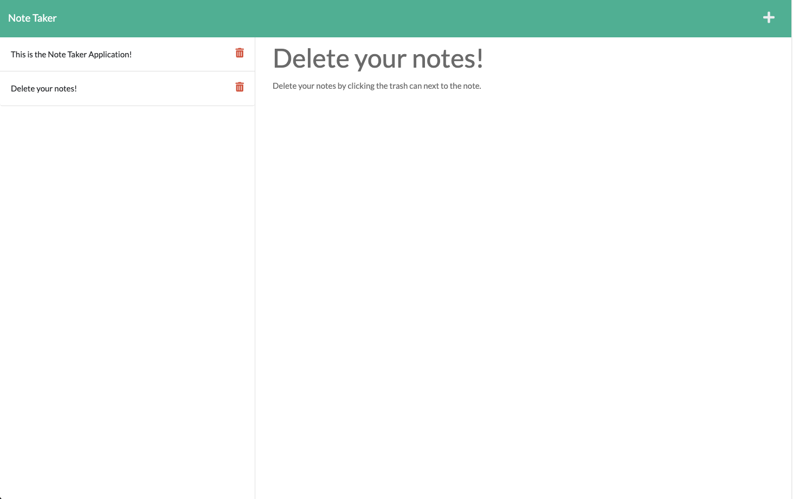

# Note Taker App

# Description
Keep track of your thoughts with the note taker app. 

# Objectives
- An application that when loaded:
    - Opens the note taker website.
    - Allows the user to create a new note with a title and text.
    - Allows the user to save the note through a save button.
    - When the note is saved, it shows up on the left hand side of the page.
    - The saved notes do not dissapear after page loads. 
    - Allows the user to delete the note with the trashcan button

# Images

# Usage from terminal
- Run `npm i` on the note_taker directory
- Run `node server.js`
- Open `localhost:3001` on your browser

# Collaborators
- Salissa Hernandez: https://github.com/Salissa4
- Gunner Wagoner: https://github.com/GunnySensei

# Links
- GitHub repo: https://github.com/ggggglo/note_taker
- Heroku deployment: https://fathomless-sands-16658.herokuapp.com/